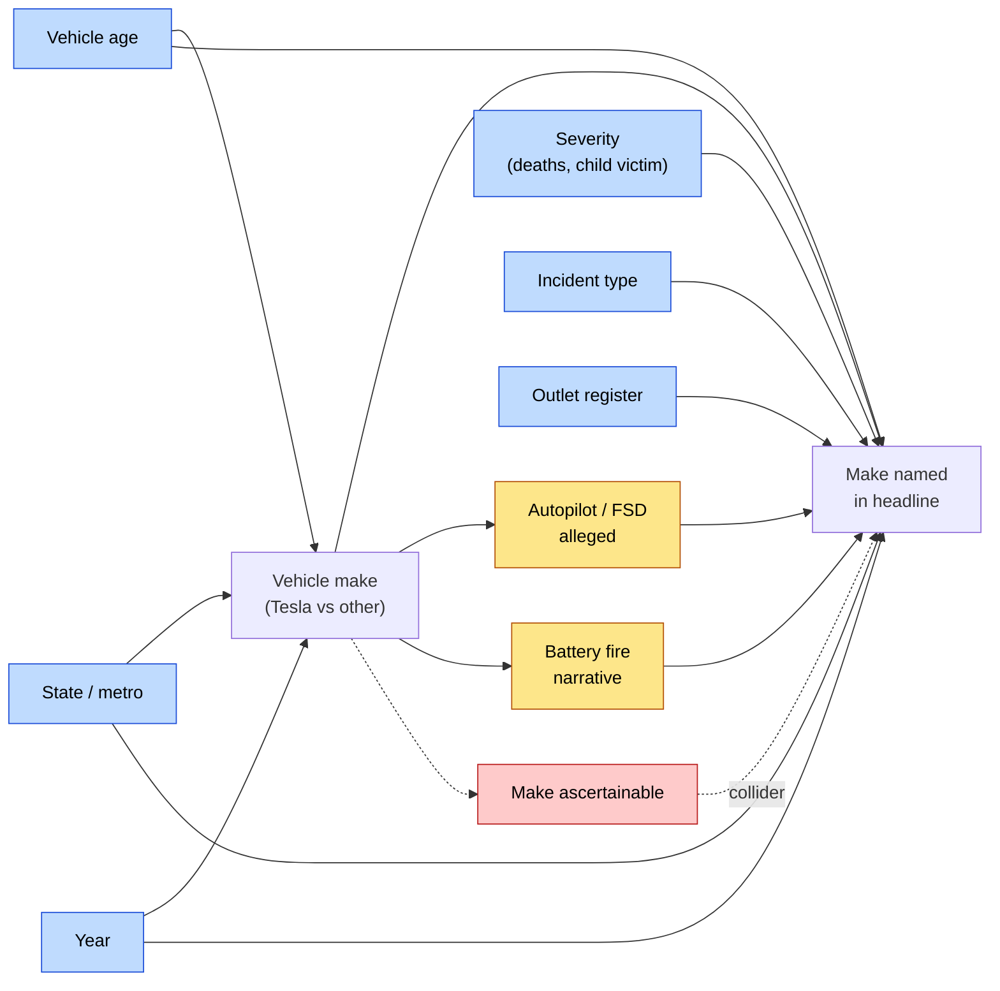

# Study protocol — Brand salience in Australian news headlines about vehicle incidents

**Short title:** The Tesla Headline Study
**Version:** 0.2 (DRAFT)
**Design:** Retrospective observational study of news content (media-content analysis)
**Track:** Lean — personal research, done properly (see §0)
**Status:** Protocol written before any outcome data extracted. Freeze before Phase 3.

---

## 0. Study track

This is a **personal research project**, not a journal submission. The distinction
changes what is worth doing, and it is worth being explicit about which parts are which,
because the temptation under "it's just for me" is to drop the wrong half.

**Kept in full — these protect the validity of the answer:**

| | Why it stays |
|---|---|
| Brand-agnostic sampling frame (§6.1) | Without it the study is circular. Non-negotiable. |
| Freeze before outcome extraction (§11 Phase 2) | A protocol written after seeing the data isn't a protocol. |
| Pre-specified analysis, run once (§9) | The alternative is fishing until something is significant. |
| Two-tier make ascertainment + Tier-1 sensitivity (§7.2) | The collider is real whoever is reading. |
| Mechanical primary outcome (§8.1) | The cheapest bias-removal available. |
| Negative controls (§9.4) | The fastest way to catch a model measuring the wrong thing. |
| Seed examples excluded (§13) | They are the biased sample that generated the hypothesis. |
| Reporting the interval, and reporting nulls (§14) | The point is to find out, not to be right. |

**Relaxed — these exist to convince reviewers, and there are none:**

| Journal version | Lean version |
|---|---|
| OSF pre-registration with a DOI | Git tag `protocol-v1` + content hashes recorded in the `provenance` table. Same function: an auditable timestamp that predates the data. |
| Two independent human coders, Cohen's κ | LLM-assisted coding with human adjudication, validated against a hand-coded gold standard (§8.2). |
| Formal HREC exemption correspondence | No human participants and no identified individuals recorded; §8.5 handling rules stand. |
| STROBE checklist as a submission requirement | STROBE used as a self-discipline checklist, not filed. |
| Formal conflict-of-interest declarations | One line in the writeup if any vehicle ownership is relevant. |

**The lean track does not license:** changing the outcome definition after seeing
results, dropping a sensitivity analysis because it was inconvenient, or quietly widening
the window until the sample is big enough. If the answer is "under-powered, wide
interval, don't know" — that is the finding, and it is worth having.

---

## 1. Background and rationale

Anecdotally, Australian news reports of road-vehicle incidents appear to name the
vehicle's make in the **headline** more often when the vehicle is a Tesla than when it
is a Toyota, Ford, or Hyundai. Naming a make in a headline attributes the event, at
least implicitly, to the product rather than to the driver, the road, or the
circumstances. If that attribution is applied unevenly across makes, it distorts public
risk perception of particular vehicles — the same mechanism that makes single-source
media reporting a recognised driver of skewed risk beliefs in health and safety
domains.

The observation is currently an impression formed from memorable examples. Memorable
examples are exactly what a salience effect would produce, so the impression cannot
serve as evidence for itself. This protocol specifies a design that can distinguish a
real difference from the recall bias that generated the hypothesis.

## 2. Objectives

### Primary objective
Estimate whether, among Australian news articles reporting a road-vehicle incident, the
odds that the index vehicle's make is identified **in the headline** differ when that
make is Tesla compared with all other makes.

### Secondary objectives
1. Separate a *Tesla* effect from a general *electric vehicle* effect (Tesla vs other BEV makes).
2. Separate a *Tesla* effect from a general *premium/expensive vehicle* effect (Tesla vs premium ICE makes).
3. Estimate the effect within multi-vehicle crashes where a Tesla and a non-Tesla were both involved (self-matched).
4. Describe where in the article the make first appears (headline / standfirst / lede / body / absent).
5. Describe heterogeneity by outlet type, jurisdiction, incident type, and year.

## 3. Hypotheses

- **H0 (primary):** adjusted OR for headline make-identification, Tesla vs non-Tesla, = 1.
- **H1 (primary):** OR ≠ 1 (two-sided, α = 0.05).

The directional hunch is OR > 1. The test is two-sided anyway: a two-sided test of a
hypothesis generated by anecdote is the honest choice, and the cost in power is small.

## 4. Design overview

Two-level observational design.

```
Incident (level 2)  ──┬── Article 1 (level 1)   outcome: make in headline? 0/1
  exposure: make      ├── Article 2
  = Tesla / other     ├── Article 3
  confounders:        └── ...
  severity, type,
  state, year
```

- **Unit of analysis:** the article.
- **Unit of exposure:** the incident (make is a property of the incident, not the article).
- **Clustering:** articles within incidents; articles within outlet-groups (syndication).
- The exposure is assigned by the world, not by us; this is an observational comparison
  and every causal claim in Section 12 is conditioned accordingly.

## 5. Setting and period

- **Population:** road-vehicle incidents occurring in Australia (all states and territories).
- **Period:** incidents occurring **2023-01-01 to 2025-12-31** (three complete calendar
  years). Complete years avoid a partial-year tail where coverage is still accruing.
  Pre-specified extensions if Phase 0 shows too few Tesla incidents: back to 2021-01-01,
  then to 2019-01-01 (see Section 10.4).

  **Why three years and not five.** Australia's Tesla fleet only reached meaningful scale
  around 2022. Calendar 2021 and 2022 would therefore have contributed very few exposed
  incidents while contributing a full share of unexposed ones, of harvest cost, and of
  secular drift in editorial norms. Trimming them raises the Tesla density of the frame,
  narrows the range the `year` covariate has to absorb, and roughly halves the harvest.
  The cost is a smaller absolute Tesla arm — which is the binding constraint — so §10.4's
  first fallback is simply to put 2021–2022 back.
- **Coverage window per incident:** articles published from the incident date to
  incident date + 14 days. Later articles (inquest, trial, sentencing) are a separate,
  pre-specified exploratory stratum, not part of the primary dataset — court reporting
  has different naming conventions.

## 6. Sampling frame — the part that decides whether this study is worth doing

**The central threat to this study is that Tesla incidents are easier to find precisely
because they say "Tesla".** If incidents are discovered by searching for crashes, and
Tesla crashes surface more readily because the brand is in the headline, then the
exposed and unexposed groups are ascertained by the outcome itself, and any result is
circular.

The frame is therefore constructed to be **brand-agnostic at the discovery step**:

### 6.1 Discovery queries contain no brand terms
Articles are harvested with a fixed query set built only from event vocabulary — `crash`,
`collision`, `smash`, `killed`, `died`, `fatal`, `pedestrian struck`, `car fire`,
`vehicle fire`, `rolled`, `ploughed`, `head-on` — restricted to Australian sources.
The full frozen query list is `src/queries.py`; it is version-controlled and must not
change after Phase 1 begins. **No query may contain a make, model, or fuel-type term.**

### 6.2 Sources
| Source | Role | Coverage |
|---|---|---|
| GDELT DOC 2.0 API (`sourcecountry:australia`) | primary harvest — headline + URL + outlet + timestamp | 2017–present |
| Common Crawl CC-NEWS (via `news-please`) | second harvest; catches outlets GDELT indexes thinly | 2016–present |
| Wayback Machine CDX API | earliest archived headline (see 8.3) | variable |
| Outlet news sitemaps | gap-filling for named outlets | ~2 years rolling |
| ~~ProQuest ANZ Newsstream / Factiva~~ | **Not available** — no institutional access. Would have given complete full text, original headlines and clean outlet metadata; its absence is why the dual-source harvest and the §8.3 headline-versioning rules matter more here. | — |
| State police media-release feeds (NSW, VIC, QLD, WA, SA, TAS, NT, ACT) | independent make ascertainment (Tier 1) | varies |
| Coronial findings (this repository's own corpus) | independent make ascertainment (Tier 1), delayed | varies |

Two independent harvest sources are used because outlet coverage in any single index is
uneven, and uneven *by outlet* is tolerable while uneven *by brand* is not. Agreement
between GDELT and CC-NEWS on the article set for a random 20 incidents is reported as a
frame-quality check.

### 6.3 Incident construction
Harvested articles are clustered into incidents by (a) event date window ±3 days,
(b) location match against an Australian suburb/LGA gazetteer, (c) casualty count, and
(d) text similarity. Every cluster is then **manually verified** by one reviewer, and a
20% random sample double-checked by a second. Clustering operates on article text and
may use brand tokens for merging, but never for inclusion.

### 6.4 Eligibility

**Incident inclusion** — all of:
- occurred in Australia within the study period;
- involved at least one road-registrable motor vehicle;
- resulted in **at least one death, or at least one person admitted to hospital in a
  critical/serious condition, or a vehicle fire**;
- covered by articles from **≥ 3 distinct outlet groups** (a denominator is needed to
  compute a proportion; single-outlet incidents carry no information about
  cross-outlet naming);
- the index vehicle's make is ascertainable (Section 7.2).

**Incident exclusion:**
- heavy vehicle / truck / bus as the index vehicle (naming conventions differ — "truck"
  is a category, not a brand, in most headlines);
- motorcycles (same reason);
- deliberate acts already framed as crime at first report (ram-raid, police pursuit,
  vehicular attack) — brand naming there follows crime-reporting conventions;
- incidents on private property, race tracks, or off-road;
- incidents outside Australia even if Australian-reported.

**Article inclusion:** published by an outlet on the outlet list (`docs/OUTLETS.md`),
within the coverage window, in English, and substantively about the index incident
(not a round-up mentioning it in one line — see Codebook rule A4).

## 7. Variables

### 7.1 Exposure
`make_group`, from the index vehicle's make:
- `tesla`
- `other_bev` — BYD, Polestar, MG (BEV models only), Kia/Hyundai BEV models, Nissan Leaf, Volvo BEV, etc.
- `premium_ice` — BMW, Mercedes-Benz, Audi, Porsche, Range Rover/Land Rover, Lexus, Jaguar, Maserati, Ferrari, Lamborghini
- `mainstream_ice` — Toyota, Mazda, Hyundai, Kia, Ford, Mitsubishi, Nissan, Subaru, Holden, VW, Honda, Isuzu, GWM, MG (ICE)

Primary contrast: `tesla` vs all others pooled. Secondary contrasts: `tesla` vs
`other_bev`; `tesla` vs `premium_ice`.

### 7.2 Ascertainment tier for make (`make_tier`)
- **Tier 1 — media-independent:** police media release, court/coronial document, crash
  investigation report, insurer/regulator statement, or a photograph in which the
  vehicle is identifiable and coded by a reviewer blinded to headline text.
- **Tier 2 — media-dependent:** stated only in the body text of at least one article.

Primary analysis uses Tier 1 ∪ Tier 2. **Pre-specified sensitivity analysis uses Tier 1
only.** If the two disagree materially, the Tier 1 estimate is the one to believe, and
the paper says so.

### 7.3 Primary outcome
`headline_names_make` (binary, per article): the index vehicle's make is identified in
the headline as published.

"Identified" means the headline contains **either**:
- a make token (`Tesla`, `Toyota`, `BMW`, …), **or**
- a make-specific model token (`Model 3`, `Model Y`, `Cybertruck`, `Corolla`, `HiLux`,
  `Ranger`, `Golf`, …).

Including model tokens matters for fairness: "HiLux ploughs into shopfront" identifies
the make to any Australian reader just as "Tesla crashes into shopfront" does. Counting
only literal make tokens would build the hypothesis into the outcome definition. The
make-token-only definition is run as a pre-specified sensitivity analysis.

The lexicon lives in `src/lexicon.py`, is frozen before Phase 2, and includes
disambiguation rules (Codebook §3) for tokens that are also ordinary words or names
(`Tesla` the physicist/company, `Ranger`, `Territory`, `Focus`, `Escape`, `Fit`).

### 7.4 Secondary outcomes
- `body_names_make` (binary) — make identified anywhere in the article body. **Negative
  control outcome:** if Tesla is named in headlines more often but in bodies at the same
  rate, the effect is specifically about headline placement rather than about how
  identifiable the vehicle was.
- `first_mention_position` (ordinal): `headline` < `standfirst` < `first_paragraph` <
  `later_body` < `absent`.
- `image_shows_vehicle` (binary), `make_in_image_caption` (binary) — exploratory.

### 7.5 Covariates (pre-specified)
Adjusted for in the primary model:
- `deaths` (0 / 1 / ≥2)
- `incident_type` (occupant-fatal collision / pedestrian or cyclist struck / single-vehicle fire / other)
- `state`
- `year`
- `vehicle_age_band` (≤2y / 3–7y / ≥8y / unknown) — newer cars are more identifiable and
  Tesla's Australian fleet is young; leaving this out would let fleet age masquerade as brand effect
- `multi_vehicle` (binary)
- `victim_child` (binary) — strong independent driver of coverage intensity

Recorded but **deliberately not in the primary model** (candidate mediators, Section 9.5):
- `adas_alleged` — Autopilot/FSD/self-driving raised in any coverage
- `fire_involved` where fire is the story
- `driver_notable` — driver is a public figure

Adjusting for a mediator would remove part of the very pathway that the hypothesis is
about, so these enter only in the mediation-flavoured secondary model.

### 7.6 Article/outlet variables
`outlet`, `outlet_group` (ownership: News Corp, Nine, Seven West, ABC, Guardian, Ten,
independent), `outlet_register` (tabloid / broadsheet / broadcast / public), `is_wire`
(AAP or near-duplicate of a wire item), `publish_datetime`, `article_wordcount`.

## 8. Measurement procedures

### 8.1 Automated primary outcome
The primary outcome is computed **mechanically** by matching the frozen lexicon against
the headline string. It involves no human judgment about whether a headline "emphasises"
the brand. This is a deliberate design strength: it removes the coder's knowledge of the
hypothesis from the primary outcome entirely.

### 8.2 LLM-assisted coding with human adjudication (lean track)
Incident-level variables (severity, type, ADAS allegation, index vehicle) are extracted
by Claude from article body text into the fixed schema, then adjudicated by the
investigator. Implemented in `src/llm_coding.py`. Three safeguards:

1. **Headline blinding.** The model receives body text with headlines and standfirsts
   stripped (`strip_headlines()`, asserted in tests). Codebook §1.2 requires the index
   vehicle to be determined without the headline; if the headline drove exposure
   assignment, the study would be measuring its own outcome.
2. **It never codes the outcome.** `headline_names_make` comes from the frozen lexicon,
   mechanically. A model that could infer the hypothesis must not decide the outcome.
3. **Evidence and confidence per field.** Every value carries a verbatim quote and a
   confidence; anything below 0.75, or missing its quote, is routed to human review
   rather than accepted.

Machine output is written to `dual_coding` as coder `claude` — never directly into
`incident`. The `incident` table holds adjudicated values only, so a re-run can never
overwrite a human decision and agreement stays recomputable.

**Validation before use (`src/validate_coding.py`).** The investigator hand-codes 25–30
incidents *without first reading the machine output*, and agreement is computed per
variable: κ ≥ 0.90 for `index_make` (it is the exposure), κ ≥ 0.70 elsewhere.

**The differential check is the one that decides admissibility.** Overall accuracy is not
enough. If Claude recovers the make from body text more reliably for Teslas than for
other makes, Tesla incidents enter the study with better exposure ascertainment —
differential misclassification pointing in the same direction as the hypothesis, capable
of manufacturing the entire effect. Tesla recall minus non-Tesla recall must be within
±0.10. If it is not, machine-coded `index_make` is abandoned: the exposure is hand-coded
for every incident, or the analysis is restricted to Tier 1 makes.

The investigator determines the index vehicle from Tier 1 sources, **blinded to the
headline**, wherever such sources exist.

### 8.3 Headline versioning
Headlines are edited after publication. The recorded headline is the **earliest
retrievable version**: the earliest Wayback CDX snapshot within 14 days of publication,
falling back to the GDELT/CC-NEWS title captured at first crawl, falling back to the
current live headline. `headline_source` records which. Sensitivity analysis restricted
to articles with a true archived first version.

### 8.4 Syndication
AAP copy republished across outlets is not independent evidence. Detection: TF-IDF
cosine similarity ≥ 0.85 between article bodies, or an explicit AAP byline/credit.
Near-duplicate sets are flagged (`syndication_group_id`). Primary analysis keeps them
with outlet-group clustering; sensitivity analysis retains one article per
`syndication_group_id`.

### 8.5 Data handling and legal position
- Requests honour `robots.txt`, with a ≥2 second delay between requests to any host
  (matching this repository's existing scraping rules) and an identifying User-Agent.
- Stored per article: URL, outlet, timestamp, headline, and coded variables. Full body
  text is stored **locally only** for coding and duplicate detection, is not
  redistributed, and is not committed to the repository.
- Published outputs quote headlines only to the extent needed for illustration
  (fair dealing for research and criticism, *Copyright Act 1968* (Cth) ss 40–41).
- Licensed databases (Factiva/ProQuest), if used, are accessed under their own terms;
  no bulk export.
- No human participants and no personal health information — no HREC approval is
  required, but named individuals appear in the source articles and are **not** recorded
  in the study dataset. Victims are represented by counts and age bands only.

## 9. Statistical analysis

All analyses pre-specified here. `src/analysis.py` implements them and is written
against a simulated dataset before real data are extracted.

### 9.1 Primary analysis
Logistic regression of `headline_names_make` on `tesla` (binary), estimated by **GEE
with an exchangeable working correlation clustered on incident** and robust
(sandwich) standard errors, adjusted for the Section 7.5 covariates. Report adjusted OR
with 95% CI and a two-sided p-value.

GEE rather than a random-intercept GLMM as primary because the exposure is entirely
between-cluster, the estimand of interest is the population-averaged (marginal)
contrast, and GEE with robust SEs is honest under working-correlation
misspecification. A random-intercept GLMM is reported alongside as a sensitivity
analysis; if the two disagree qualitatively, both are reported and the disagreement
discussed rather than the friendlier one chosen.

Clustering is on incident. Outlet-group effects enter as fixed effects. Where the number
of incidents is small (< 40), robust SEs are small-sample-corrected (Mancl–DeRouen /
Kauermann–Carroll) and a cluster-bootstrap CI (2000 resamples over incidents) is
reported as the primary interval.

### 9.2 Incident-level companion analysis
For each incident, the proportion of eligible articles naming the make. Compared
Tesla vs non-Tesla by (a) quasi-binomial GLM with the same covariates, and (b) an
unadjusted exact Wilcoxon rank-sum test. This is a simpler, more transparent view of
the same signal and is reported next to the primary estimate, not instead of it.

### 9.3 Within-incident matched analysis (the strongest single comparison)
Restricted to multi-vehicle incidents involving a Tesla **and** at least one non-Tesla
vehicle. Each **article** is a matched set: does it name the Tesla, the other make,
both, or neither?

- **McNemar's exact test** on discordant articles (names Tesla only vs names other only).
- Conditional logistic regression stratified by article, for the version with covariates.

This design holds constant everything that plagues the between-incident comparison —
severity, location, date, outlet, individual journalist, news cycle — because both makes
are competing for the same headline. It will have a small n. It is pre-specified as a
**key secondary**, and if it points the opposite way from the primary analysis, that is
reported as the headline finding of the paper, not a footnote.

### 9.4 Negative controls
- **Negative control outcome:** repeat the primary model with `body_names_make`. A
  Tesla effect on headlines but not bodies supports headline-specific salience; an equal
  effect on both suggests the vehicle was simply more identifiable.
- **Negative control exposure:** repeat the primary model with `toyota` in place of
  `tesla` among non-Tesla incidents. Toyota is the highest-volume make on Australian
  roads and has no salience narrative attached; a large "effect" here would indicate the
  model is picking up something other than brand salience.

### 9.5 Mediation-flavoured secondary model
Add `adas_alleged` and `fire_involved` to the primary model and report the change in the
Tesla coefficient. Interpreted descriptively (how much of the association travels with
the self-driving and battery-fire narratives), **not** as a formal causal mediation
estimate — the identification assumptions for that are not met here.

### 9.6 Subgroups (pre-specified, exploratory)
By `outlet_register`, `incident_type`, `state`, and year (test for trend). Interaction
p-values reported without multiplicity adjustment and labelled hypothesis-generating.

### 9.7 Missing data
Incidents with unascertainable make are excluded and **counted in the flow diagram, by
candidate make where inferable** — a differential exclusion rate is itself a finding
worth reporting. Missing `vehicle_age_band` is carried as an explicit `unknown` level
rather than imputed. If missingness in any covariate exceeds 20%, multiple imputation by
chained equations (m = 20) is used as a sensitivity analysis.

### 9.8 Multiplicity
One primary test. Secondary objectives 1–3 form a family of three, controlled by Holm.
Everything else is exploratory and labelled as such.

### 9.9 Analysis integrity
The dataset is locked (git tag `dataset-lock-v1`) before `analysis.py` is run on real
data. The script is run once. Any post-hoc analysis appears in a separate,
clearly-labelled section.

## 10. Sample size

### 10.1 Assumptions
- Non-Tesla headline make-identification rate `p0` = 0.10
- Tesla rate `p1` = 0.35 (the effect size that would matter; smaller effects are
  interesting but this is what powers the study)
- Mean articles per incident `m` = 8
- Intracluster correlation `ρ` = 0.5 — high, because whether the make is "the story" is
  largely an incident-level property that outlets copy from each other
- Design effect = 1 + (m − 1)ρ = 4.5
- α = 0.05 two-sided, power = 0.80

### 10.2 Result
≈ 40 articles per arm before clustering → ≈ 180 per arm after → **≈ 23 incidents per
arm**. Target: **≥ 25 Tesla incidents and ≥ 100 non-Tesla incidents** (the unexposed arm
is cheap and the extra precision buys the covariate adjustment and the subgroups).

`src/power.py` recomputes this for any assumption set, including the ICC sensitivity grid.
The ρ = 0.5 assumption is the fragile one; Phase 0 estimates it from real data and the
target is revised **before** any outcome comparison is run.

### 10.3 Feasibility risk
Whether ≥ 25 eligible Tesla incidents exist in Australia in 2023–2025 is genuinely
unknown at protocol time. Serious-injury-or-worse crashes with a confirmed make are a
small subset of a fleet that, while growing fast, is still a minority of registrations.
**Phase 0 exists to answer this before any effort is committed.**

The three-year window concentrates the exposed arm rather than enlarging it, so this risk
is if anything sharper than it was over five years. The fallback ladder below is the
response, and it is ordered so the cheapest recovery — restoring the two years just
trimmed — comes first.

### 10.4 Pre-specified fallbacks, in order
If Phase 0 yields < 25 Tesla incidents:
1. Extend the period back to **2021-01-01** (restores the two years trimmed in §5). Cheap:
   the harvester is resumable, so this is one more command, not a re-run.
2. Extend further back to **2019-01-01**. Expect diminishing returns — the fleet was small
   — and a wider `year` range for the covariate to absorb.
3. Relax severity to include any crash with a hospitalisation or major property damage.
4. Add New Zealand outlets and incidents as a second population, analysed with a
   country term.
5. If still under-powered, **report it as a descriptive study with a confidence
   interval and say plainly that it is under-powered.** An honest wide interval is a
   real result; a study that quietly redefines its outcome until p < 0.05 is not.

Each rung is invoked and recorded **before** any outcome comparison is run, never after
seeing a p-value.

## 11. Phases and deliverables

| Phase | Work | Output | Gate |
|---|---|---|---|
| **0. Feasibility** | Brand-agnostic harvest for 2023–2025; cluster; count candidate Tesla incidents; estimate `m` and ρ on ~20 incidents | `output/phase0_feasibility.md` | ≥ 25 Tesla incidents, or invoke 10.4 |
| **1. Frame build** | Full harvest, clustering, manual incident verification, eligibility screening | locked incident register | κ ≥ 0.7 |
| **2. Freeze** | Freeze protocol + lexicon + queries; record content hashes in `provenance`; tag commit | git tag `protocol-v1` | before any outcome extraction |
| **2b. Coder validation** | Hand-code 25–30 incidents blind; validate LLM coding | `output/coding_validation.md` | κ and differential check pass (§8.2) |
| **3. Extraction** | Headline capture, archived-version retrieval, automated outcome coding, LLM-assisted incident coding + adjudication | locked dataset, tag `dataset-lock-v1` | every review-flagged field adjudicated |
| **4. Analysis** | Run `analysis.py` once | `output/results.md`, figures | — |
| **5. Write-up** | STROBE-structured manuscript + public artifact | manuscript | — |

Phase 2 must precede Phase 3. A protocol frozen after seeing the outcome data converts a
confirmatory study into an exploratory one wearing a confirmatory costume — and a git tag
is just as good as a DOI at proving which came first, as long as the tag is real and
pushed before extraction begins.

## 12. Threats to validity, and what is done about each

| # | Threat | Direction | Mitigation |
|---|---|---|---|
| 1 | **Brand-driven ascertainment of incidents** — Tesla crashes are found because they say Tesla | inflates effect, potentially entirely | Brand-agnostic query set (6.1), frozen and version-controlled |
| 2 | **Brand-driven ascertainment of make** — make known only because it was reported | inflates effect | Two-tier ascertainment; Tier-1-only sensitivity analysis (7.2) |
| 3 | **Fleet age** — Tesla fleet is young; new cars are more identifiable and more newsworthy | inflates effect | `vehicle_age_band` covariate |
| 4 | **Fleet composition** — Tesla owners differ (metro, higher income) so crashes differ in kind | either | `state`, `incident_type` covariates; metro/regional in subgroups |
| 5 | **Syndication** — one AAP story counted eight times | inflates precision, not effect | Duplicate detection; outlet-group clustering; one-per-group sensitivity (8.4) |
| 6 | **Headline mutation** — live headlines differ from published ones | either | Earliest archived version (8.3) |
| 7 | **Index coverage** — GDELT/CC-NEWS index outlets unevenly | either | Dual-source harvest; agreement check (6.2) |
| 8 | **Recall bias in the investigator** — the hypothesis came from memorable examples | inflates effect | Investigator does not select incidents; automated frame; named seed examples excluded from the analysis dataset (13) |
| 9 | **Secular trend** — Tesla coverage norms changed over the window | either | `year` covariate; trend subgroup. The three-year window (§5) narrows the drift the covariate has to absorb, at the cost of a smaller exposed arm |
| 10 | **"EV" vs "Tesla" confusion** | mislabels mechanism | Secondary contrast vs `other_bev` (9.x) |
| 11 | **"Premium" vs "Tesla" confusion** | mislabels mechanism | Secondary contrast vs `premium_ice` |
| 12 | **Model-token asymmetry** — Tesla model names are distinctive, Toyota's are ubiquitous | either | Model tokens count as identification (7.3); make-only sensitivity |
| 13 | **Differential LLM coding** — Claude recovers Tesla makes from text more reliably than other makes | inflates effect, potentially entirely | Gold-standard validation with an explicit Tesla-vs-rest recall differential; hard stop at ±0.10 (8.2) |
| 14 | **LLM coder sees the hypothesis** — the model could infer what is being tested | inflates effect | Headline-blinded input; the model never codes the outcome (8.2) |

Threats 1, 2, 8 and 13 are the ones that could invalidate the study outright — each is a
route by which the exposure gets ascertained by the outcome. They are the reason the
design starts from a brand-blind harvest rather than a list of remembered crashes, and
the reason machine coding has to earn its place with a differential check rather than an
accuracy score.

## 13. Seed examples

The incidents that prompted the hypothesis — the Daylesford Royal Hotel crash, the
Auburn South Primary School death, and the recent Knox crash — are recorded in
`docs/SEED_EXAMPLES.md` as **motivating examples with their facts to be verified**, and
are used only to sanity-check that the harvest pipeline finds known incidents.

They are **excluded from the analysis dataset**. Incidents selected because they were
memorable to the person forming the hypothesis are the single most biased possible
sample, and including them would import exactly the recall bias the study exists to
test. Their exclusion is recorded in the flow diagram.

## 14. Reporting

- STROBE checklist for observational studies, used as a self-discipline checklist while
  writing (not filed anywhere).
- Flow diagram: articles harvested → clustered → incidents → eligible → analysed, with
  exclusions and reasons at each step.
- All code, the frozen lexicon, the frozen query set, and the incident-level dataset
  (headlines, URLs, coded variables — no full body text) live in this repository.
- Both the primary and the Tier-1-only estimate reported in the abstract, whichever way
  they point.

## 15. Declarations

- **Funding:** none.
- **Conflicts of interest:** one line in the writeup if the investigator owns, or has any
  material relationship with, a vehicle of any make in the study — Tesla included. Worth
  stating even in a personal project: it is the reader's cue for how to weigh a result
  that happens to confirm a prior.
- **Data availability:** as in §14.
- **Freeze record:** git tag `protocol-v1`, with protocol, codebook, lexicon and query
  content hashes in the `provenance` table.

---

## Appendix A — Directed acyclic graph (assumed)



Blue = confounders, adjusted in the primary model. Amber = mediators, deliberately
**not** adjusted in the primary model (Section 7.5). Red = the collider that restricting
to make-ascertainable incidents conditions on, which is why the Tier-1 sensitivity
analysis exists.

## Appendix B — Estimand (target trial framing)

> Among Australian news articles that report a road-vehicle incident meeting the
> eligibility criteria, in the population of such incidents occurring 2023–2025, the
> ratio of the odds that the article's headline identifies the index vehicle's make when
> that make is Tesla, to the same odds when that make is not Tesla, holding constant
> incident severity, incident type, jurisdiction, year, vehicle age band, multi-vehicle
> status, and child-victim status.

This is a contrast of *editorial behaviour*, not of vehicle safety. The study cannot and
does not speak to whether any make is more or less dangerous. That distinction belongs
in the title, the abstract, and the discussion, because it is the one every reader will
get wrong.
