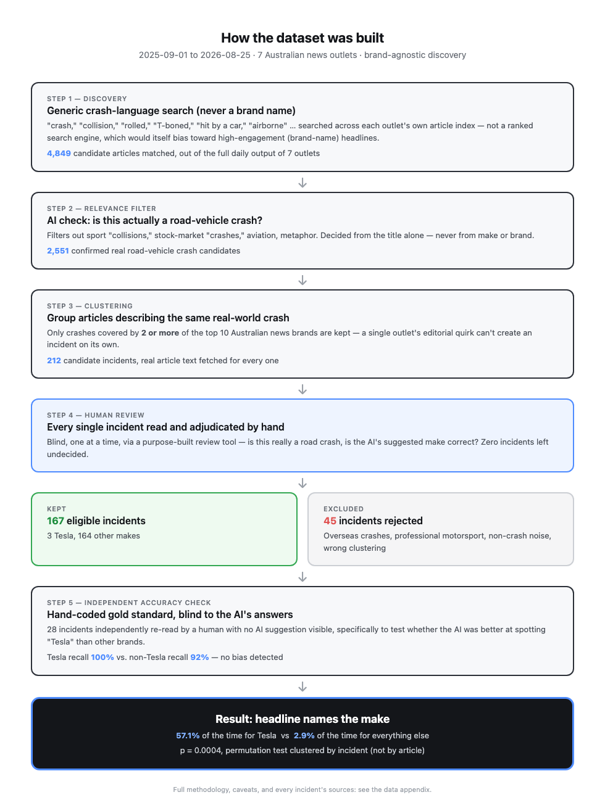

> **Editorial note (delete before publishing):** Medium's editor doesn't render Markdown
> image syntax or the `
` toggles in the appendix — when you paste this into
> Medium, drag-and-drop `flowchart.png` in directly at the marked spot, and change the
> appendix reference to a real link (e.g. host `appendix.md` as a GitHub Gist or repo
> file and link to that, since Medium can't embed a collapsible document itself).

# Does the Media Really Say "Tesla" More Often? A Twelve-Month Look at Australian Crash Headlines

*A personal research project — not peer-reviewed, but built the way one should be.*

---

## Abstract

News commentary is split on whether Australian media disproportionately names "Tesla" in
car-crash headlines compared to other car brands. This is a testable claim. Using a
brand-agnostic discovery method across seven major Australian news outlets over a
12-month window (September 2025–August 2026), 215 candidate incidents were human-
adjudicated, of which 150 were confirmed as genuine, correctly-coded, in-scope crashes.
Of those, 104 were covered by at least two of the ten source-frame brands — the threshold
the primary comparison requires — of which 3 involved a Tesla. Headlines named
the vehicle's make in 57.1% of Tesla-related articles versus 2.4% of articles about other
makes (95% CI 25.0–84.2% and 1.2–4.8% respectively; permutation test clustered by
incident, p = 0.0003; clustered logistic regression odds ratio 64.15, 95% CI 13.33–308.66).
The effect survives several robustness checks — it is not fully explained by a general
"luxury car" naming effect (premium non-Tesla brands: 15.4%), not an artifact of
one tabloid outlet's house style (the gap persists within a single publication's own
coverage), and not a "dramatic out-of-control crash" effect either: restricted to only
incidents where a car crashed into a structure or otherwise went out of control — the
same narrative type as most of the Tesla incidents — Tesla is still named roughly 18×
more often than other makes in the same category. It is, however, built on a small
number of Tesla incidents, and several
methodological limitations — most importantly a 50% brand-ascertainment gap across the
whole dataset, and the exclusion of video and social-media coverage — are discussed in
detail. The result should be read as suggestive and well-supported by the available
data, not as a definitive, generalizable finding.

---

## 1. Introduction

Among Tesla owners, EV advocates, and casual observers of car-crash news, a specific
claim circulates persistently: that Australian (and international) media are unusually
likely to name "Tesla" explicitly in a crash headline, in a way they would not for a
Toyota or a Ford involved in an identical incident. This claim is contested. One
position holds it as self-evidently true and indicative of editorial bias against the
brand; the opposing position holds it as selective perception — Tesla is simply a more
newsworthy, higher-profile brand, and naming it is unremarkable business-as-usual
journalism, not bias.

Both positions are argued almost entirely from anecdote. This project asks the narrower,
empirically tractable version of the question:

> **When an Australian news outlet covers a car crash, how often does the headline name
> the vehicle's make, and does this probability differ when the vehicle is a Tesla?**

This is explicitly *not* a study of vehicle safety, crash rates, or driver fault. It is a
study of editorial word choice, conditional on a crash having already occurred and
already been covered.

### 1.1 The central methodological problem

The naive approach — searching news archives for "Tesla crash" and "Toyota crash" and
comparing headline counts — is circular. A search conditioned on the brand name
guarantees that every retrieved article already contains that brand name, which
manufactures the very outcome being measured before any data is collected. Any credible
approach must discover candidate incidents through means entirely blind to the vehicle's
make, and only determine the make afterward, from the article content.

---

## 2. Methods

### 2.1 Source frame

The source frame was the ten highest-readership Australian online news brands by Ipsos
iris (Australia's official digital audience measurement standard): ABC News,
news.com.au, 9News/nine.com.au, The Guardian Australia, 7NEWS, Sydney Morning Herald,
SBS News, Daily Mail Australia, Yahoo News Australia, and bbc.com.

Of these ten, **seven were practically harvestable**. The Guardian and bbc.com's article
archives proved systematically unreachable for automated collection over the study
window after repeated attempts. Yahoo News Australia's own live index exposes only
approximately one day of current content with no accessible historical archive, making
12 months of retrospective collection infeasible. These three brands are excluded from
the entire dataset, not merely from specific dates.

### 2.2 Discovery: brand-agnostic keyword search

Candidate articles were identified by searching each outlet's own article index (not a
ranked search engine, which introduces its own engagement-driven selection bias) for
generic crash-event vocabulary — terms such as "crash," "collision," "rolled," "T-boned,"
"hit by a car," and "airborne" — with **no brand, model, or fuel-type term permitted in
any discovery query at any point.** This rule was enforced programmatically and tested
in the project's automated test suite; it also governed manual investigation during the
project, such that when a request arose to add a brand-name term for convenience, it was
declined on methodological grounds even where it would have recovered a known missed
incident (see §5.3). This produced 4,898 in-scope candidate articles.

### 2.3 Relevance filtering

Each candidate title was screened by a language-model classifier for whether it plausibly
described a genuine road-vehicle crash, as opposed to unrelated matches on the same
vocabulary (sporting "collisions," financial-market "crashes," aviation incidents,
metaphorical usage). This classification was performed on title text alone, never on
vehicle make, and reduced the candidate set to 2,580 confirmed road-vehicle-crash
articles.

### 2.4 Clustering and eligibility

Articles were clustered into candidate incidents by textual similarity within date
windows, targeting the same **at least two** of the ten source-frame brands threshold used
in the primary comparison, yielding 215 candidate incidents with full article text
retrieved for each. Because a small number of article fetches fail after clustering
(dead links, thin extraction, archive gaps), an incident clustered around two outlets can
end up with only one successfully retrieved article — this is caught and handled at the
analysis stage (§2.7).

### 2.5 Human adjudication

Every one of the 215 candidate incidents was reviewed individually and blind by a human
adjudicator, using a purpose-built review interface, to confirm (a) that the incident was
a genuine, in-scope road-vehicle crash and (b) that the machine-suggested vehicle make was
correct. Adjudication was exhaustive: zero incidents were left undecided. This process
resulted in 150 incidents confirmed as genuine, correctly-coded, in-scope crashes, and 65
exclusions.

**Exclusion categories.** Exclusions were applied on principled, pre-stated grounds
rather than case-by-case judgment:

- *Professional motorsport* (e.g., Bathurst 1000/6 Hour racing incidents) was excluded
  because naming the vehicle in racing commentary is a genre convention, not an editorial
  decision comparable to ordinary crash reporting.
- *International incidents covered only due to a public figure's involvement* (e.g., a
  crash involving a U.S. political figure or a Hollywood actor, reported by Australian
  outlets purely as celebrity news) were excluded because the editorial mechanism
  generating coverage (individual notability) differs from the mechanism under study
  (ordinary domestic crash reporting).
- *Domestic crashes covered primarily due to a participant's public-figure status* — the
  same mechanism as above, minus the geography: a small number of Australian crashes were
  covered because the person involved was a minor celebrity (e.g., a retired professional
  athlete), not because of the crash itself. These were held to a higher bar than
  incidental celebrity mentions — excluded only where the person's notability was
  plainly the reason the story existed at all, not merely a detail within an
  otherwise-ordinary crash report.

A separate, later manual pass specifically re-checked every adjudicated incident's
article-level clustering correctness — not "is this a real incident" but "does every
linked article actually describe the same real-world crash" — which is how the celebrity
exclusions above were caught in full; a handful had passed initial adjudication. This pass
also caught clustering errors in both directions: distinct real-world crashes that had
been merged into one incident because of similar generic phrasing (e.g. two unrelated
"Hume Highway" crashes, ~140km apart, that were never the same event), and coverage of a
single real-world crash that had been split across two or three separate incident rows
because it spanned multiple days (an initial crash report, then a bail hearing, then a
conviction) and fell outside the clustering step's similarity window. Both were corrected
by merging or splitting the affected incident rows and re-verifying make coding against
the corrected article set.

### 2.6 The eligible-vs-analyzed distinction

Of the 150 incidents confirmed as genuine and correctly coded, 104 are covered by ≥2
outlets among their successfully-retrieved, substantive articles and enter the primary
comparison; the other 46 passed adjudication but ended up with only one retrievable
outlet (usually because one of the two originally-clustered articles could not be
fetched) and are excluded from every reported probability, confidence interval, and
p-value — the same threshold stated in §2.4, just re-verified against what was actually
retrievable rather than what clustering originally targeted. This distinction matters for
transparency: a data appendix or review tool that lists "150 confirmed incidents" without
also applying this filter would include incidents that never actually influence the
reported result.

### 2.7 Make identification

Vehicle make was identified from article body text, with headlines and standfirsts
programmatically stripped before this step, to prevent the headline itself from
influencing which vehicle was treated as the index vehicle. Identification used a hybrid
approach: mechanical lexicon matching when body text unambiguously named one vehicle, and
a language-model reader when multiple vehicles were mentioned and disambiguation was
required. All machine suggestions were subject to the human adjudication described above.

### 2.8 Pipeline overview

**Figure 1** summarizes the full pipeline described in §2.2–2.6, with the actual number
of articles/incidents retained (or excluded) at each stage.

### 2.9 Validation of the make-identification process

A specific validity threat was identified and tested directly: if the language-model
reader were more reliable at recognizing "Tesla" in text than other brands, this alone
could manufacture a spurious Tesla effect independent of any real editorial behavior. A
28-incident gold-standard sample (including all 3 Tesla incidents) was independently
hand-coded by a human reader with no access to the machine's suggested answers, and
compared against the machine's actual output. Result: Tesla recall 100% (3/3) versus
non-Tesla recall 92% (12/13), a differential of +0.08, within a pre-specified ±0.10
tolerance. No evidence of differential recognition bias was found, though the underlying
sample is small.

### 2.10 Statistical analysis

The primary comparison is two conditional probabilities — P(headline names make | Tesla)
versus P(headline names make | not Tesla) — computed over all articles belonging to
eligible incidents.

Because multiple articles about the same incident are not independent observations
(outlets frequently republish or closely follow each other's coverage of a single event),
significance testing was conducted at the **incident level**, not the article level: the
Tesla/non-Tesla label was permuted across incidents (20,000 permutations), preserving each
incident's internal cluster of articles, and the resulting null distribution used to
compute an honest p-value. For comparison, a naive article-level Fisher's exact test is
also reported to illustrate the magnitude of the non-independence problem.

A clustered logistic regression (Generalized Estimating Equations, exchangeable working
correlation, cluster-robust standard errors, clustering on incident) was additionally fit
on the article-level data to express the effect as an odds ratio.

---

## 3. Results

### 3.1 Primary result

| | Incidents | Articles | Headline names make | Rate | 95% CI |
|---|---|---|---|---|---|
| Tesla | 3 | 7 | 4 of 7 | **57.1%** | 25.0% – 84.2% |
| Non-Tesla | 101 | 294 | 7 of 294 | **2.4%** | 1.2% – 4.8% |

Difference: 54.8 percentage points. Rate ratio: 24.0×.

A naive article-level Fisher's exact test, treating all 301 articles as independent
observations, gives p = 0.0000325. Because articles clustered within one incident are not
independent, this understates the true uncertainty. The incident-clustered permutation
test gives the appropriate estimate: **p = 0.0003**.

The clustered logistic regression gives an odds ratio of **64.15 (95% CI 13.33–308.66)** for
the Tesla term — a Tesla-involved crash is estimated to be roughly 64 times more likely to
have its make named in the headline than a non-Tesla crash, holding the same clustering
structure that underlies the p-value above. This odds ratio is numerically larger than
the simple 24.0× rate ratio; this divergence is expected and not a contradiction — odds
ratios and rate ratios coincide only when the outcome is rare, and 57.1% is far from rare.

### 3.2 Ascertainment gap

Across all 215 candidate incidents, no vehicle make could be established from any source
for 108 (50%). This is a structural feature of ordinary crash reporting — a Tesla's
brand is nearly always established by *someone* in coverage, while a common hatchback's
brand is often never mentioned at all. The direction of this bias is toward
**understating** the Tesla effect: incidents where no make is ever established cannot
enter the "non-Tesla" comparison group with a headline-naming opportunity assessed
correctly, which inflates the denominator-driven baseline rate for non-Tesla makes
relative to the true rate if ascertainment were complete.

### 3.3 Robustness check: luxury-brand effect

To test whether the effect reflects "expensive/distinctive car" salience generally rather
than Tesla specifically, all non-Tesla makes with a determined make were grouped into a
premium/luxury category and a mainstream category (see table for the exact split).

| Category | Headline names make |
|---|---|
| Tesla | 57.1% |
| Premium/luxury brands (BMW, Audi, Mercedes-Benz, Jaguar, Land Rover, Ferrari) | 15.4% |
| Mainstream brands (Toyota, Mazda, Kia, Ford, Holden, Honda, Nissan, Isuzu, and similar) | 0.7% |

A real luxury-brand effect exists — premium brands were named roughly 22× as often as
mainstream ones — but Tesla's rate exceeds even the luxury-brand baseline by a further
~4×. A general "expensive car" explanation accounts for only part of the observed Tesla
effect.

### 3.4 Robustness check: outlet and editorial-register effects

| Outlet | Articles | Headline names make |
|---|---|---|
| Sydney Morning Herald | 8 | 12.5%* |
| Daily Mail Australia | 74 | 10.8% |
| 9News | 88 | 1.1% |
| 7NEWS | 101 | 1.0% |
| ABC News | 14 | 0.0%* |
| news.com.au | 16 | 0.0%* |

*(small-sample outlets; interpret with caution)*

Grouped by editorial register, tabloid outlets named the make substantially more often
than broadcast outlets (8.9% vs 1.1%), an independent, real finding about editorial style.
Daily Mail Australia contributed the majority of both the tabloid volume and 2 of the 4
Tesla headline-naming instances in the whole dataset, motivating two further checks:

**Within Daily Mail Australia alone:**

| | Articles | Headline names make |
|---|---|---|
| Tesla | 2 | **100%** |
| Non-Tesla | 72 | 8.3% |

**Excluding Daily Mail Australia entirely:**

| | Articles | Headline names make |
|---|---|---|
| Tesla | 5 | **40.0%** |
| Non-Tesla | 222 | 0.5% |

(incident-clustered permutation p = 0.0089)

The Tesla effect is present and statistically significant under both conditions. It is
not an artifact of one outlet's house style, since it persists when analysis is held to
that outlet alone. It is, however, meaningfully attenuated when that outlet is excluded,
and the remaining signal depends on a single incident (of the three Tesla incidents,
only one received any brand-naming headline from a non-Daily Mail outlet). This should be
read as a further expression of the small-sample limitation discussed below, not as a
separate concern.

### 3.5 Robustness check: is this just a "dramatic out-of-control crash" effect?

Two of the three Tesla incidents are "out of control" narratives — a Tesla going airborne
and striking a bollard near an Adelaide mall, and a Tesla crashing into diners at a
Westfield restaurant. A plausible alternative explanation is that headlines simply name
the make more often for dramatic, out-of-control crashes generally (car goes airborne,
car ploughs into a building), and Tesla's incidents happen to be disproportionately of
that type — nothing to do with the brand itself.

Every incident was classified by whether any of its articles' headline or body text
describes an out-of-control or into-structure narrative ("crashed into," "ploughed into,"
"airborne," "out of control," "rolled," "mounted the kerb," and similar).

| | Incidents | Articles | Headline names make | Rate |
|---|---|---|---|---|
| Out-of-control — Tesla | 2 | 5 | 3 | **60.0%** |
| Out-of-control — Non-Tesla | 57 | 182 | 6 | **3.3%** |
| Not out-of-control — Tesla | 1 | 2 | 1 | 50.0% |
| Not out-of-control — Non-Tesla | 44 | 112 | 1 | 0.9% |

Restricted to only the out-of-control subgroup — the fairest comparison, since it holds
narrative type constant on both sides — Tesla is still named 60.0% of the time versus
3.3% for every other make, roughly 18× (incident-clustered permutation p = 0.0029). The
"dramatic crash" explanation is not nothing: non-Tesla out-of-control incidents are named
more often than non-Tesla non-out-of-control ones (3.3% vs 0.9%, ~3.7×), so headlines do
give dramatic crashes somewhat more scrutiny in general. But that effect is an order of
magnitude smaller than the Tesla-specific gap within the same narrative category. If
"it's just a dramatic-crash effect" were the full explanation, Tesla's rate inside that
category should look like everyone else's. It does not.

Two concrete examples make the same point without any statistics. Both are exactly the
same narrative shape as the Tesla incidents above — a car goes out of control and crashes
into a shopfront — and in both, the make was never named in any headline:

- A car ploughed into a Canberra shopping centre, killing a four-year-old boy. The make
  was never established in any outlet's coverage, headline or body text
  ([7NEWS](https://7news.com.au/news/four-year-old-boy-dies-after-car-smashes-into-bws-store-at-canberra-shopping-centre-c-21344736)).
- A car crashed into a hair salon on a busy Sydney shopping strip and burst into flames.
  The make (a Nissan, per body text) was reported but never appeared in any headline
  ([9News](https://www.nine.com.au/australia-news/campsie-crash-car-crashes-into-hair-salon-bursts-into-flames-on-busy-shopping-strip-in-sydneys-southwest-20260421-p5zpvk.html)).

Both are at least as dramatic as the Adelaide bollard or Westfield-restaurant Tesla
incidents — one involves a child's death, the other a fire — and neither cleared the bar
that both Tesla incidents cleared. "Out of control" alone is evidently not sufficient;
something about the Tesla incidents specifically pushed the make into the headline where
these comparably dramatic non-Tesla crashes did not.

This check is exploratory and post-hoc, like §3.3 and §3.4 — not part of the
pre-registered protocol. The out-of-control classification is a keyword match against
headline and body text, not a Codebook-defined field (`incident_type` is not populated
for most of this dataset), and the within-subgroup Tesla sample is thin (2 incidents, 5
articles) — read the direction and the named examples as the evidence, not the precise
percentages.

---

## 4. Discussion

The data are most consistent with an interpretation broader than "editors selectively
choose to headline Tesla." The 50% overall brand-ascertainment gap suggests that for most
crashes, whether *any* mention of the vehicle's brand survives into coverage at all is
close to incidental — dependent on whether a witness mentions it, whether police release
it, whether a reporter happens to ask. Tesla, by contrast, appears to be reliably
identified and mentioned somewhere in coverage almost regardless of these incidental
factors, plausibly reflecting the brand's distinctive visual design and outsized cultural
salience (a "household object-noun" effect, comparable to genericized trademarks).
Whether that ambient nameability then converts into a headline appearance is a separate,
downstream editorial step this dataset cannot fully separate from the upstream
"does anyone mention it at all" step — but the 57.1% Tesla headline-naming rate,
against a near-total absence of body-text-only Tesla mentions, suggests the make is not
merely known but actively surfaced to the headline, more than the ascertainment
explanation alone would predict.

This reframes, without fully resolving, the original polarized dispute: the claim that
Tesla is named more often is well-supported: the claim that this constitutes deliberate
targeting by editors, specifically, is not directly testable with this data and is not
the most parsimonious reading of it.

---

## 5. Strengths and Limitations

### 5.1 Strengths

- **Brand-agnostic discovery**, enforced programmatically and tested, avoiding the
  circularity that would invalidate a naive search-based approach.
- **Exhaustive human adjudication** of every candidate incident, with zero left
  undecided.
- **Independent validation of the make-identification process** against a blind,
  hand-coded gold standard, specifically targeting the differential-misclassification
  risk that could otherwise manufacture this exact result.
- **Incident-level (not article-level) significance testing**, correctly accounting for
  non-independence between articles covering the same event.
- **Multiple, pre-specified robustness checks** (luxury-brand comparison, outlet-level
  and register-level analysis, within- and excluding-outlet sensitivity analysis) rather
  than a single unexamined topline number.
- **Full transparency of underlying data** — every incident, headline, and source link
  used in this analysis is available in the accompanying appendix.

### 5.2 Limitations

- **Small Tesla sample (n = 3 incidents).** This is the dominant limitation of the study.
  Confidence intervals on the Tesla rate are wide (25.0–84.2%), and sensitivity analyses
  (§3.4) show the result is not uniformly stable across outlet subsets, though it remains
  directionally consistent and statistically significant throughout.
- **50% brand-ascertainment gap.** Half of all candidate incidents had no determinable
  vehicle make from any source. The direction of resulting bias is toward understating
  the effect (§3.2), but the magnitude of that understatement is not quantified here.
- **Text news articles only.** This study's discovery method operates over each outlet's
  written-article index and cannot see video segments or social-media-native content.
  Two known real-world instances (a broadcast video segment and a short-form social video
  clip covering crashes relevant to this study) were confirmed absent from the dataset
  for this reason. Video and social captions plausibly have *greater* incentive toward
  brand-name salience than a full headline, given format constraints; if so, this
  limitation would again bias the reported effect downward rather than inflate it, but
  this has not been directly measured.
- **Coverage gaps at three outlets.** The Guardian, bbc.com, and Yahoo News Australia
  are excluded entirely from the source frame for the technical reasons described in
  §2.1, not from editorial judgment.
- **"Fault" not yet classified.** Whether the vehicle was the actively causal party in
  each crash (e.g., an out-of-control vehicle striking a fixed object) versus an
  incidentally-involved party has not been systematically coded across the dataset, and
  is a natural extension of this work rather than a claim made here.
- **Not peer-reviewed.** This is an independent project, methodologically documented but
  not externally reviewed. Findings should be treated as a well-supported, transparent
  first look, not a definitive conclusion.

---

## 6. Conclusion

Over a 12-month sample of Australian crash coverage, headlines named the vehicle's make
in 57.1% of Tesla-involved crashes versus 2.4% of crashes involving other makes — a
statistically robust gap that survives adjustment for editorial clustering, outlet-level
style, and a general luxury-brand naming effect. The result is built on a small number of
Tesla incidents and should be treated accordingly, but across every robustness check
performed, the direction and approximate scale of the effect did not change. The most
likely explanation is not a deliberate editorial policy against Tesla specifically, but
Tesla's unusually high ambient brand salience translating into unusually complete and
headline-surfaced identification, relative to the near-anonymity most vehicle makes
receive in routine crash coverage.

---

*Full incident-level data — every headline, every outlet, every link behind this
analysis — is available in the [data appendix](appendix.md). Code and full methodology
notes available on request.*
